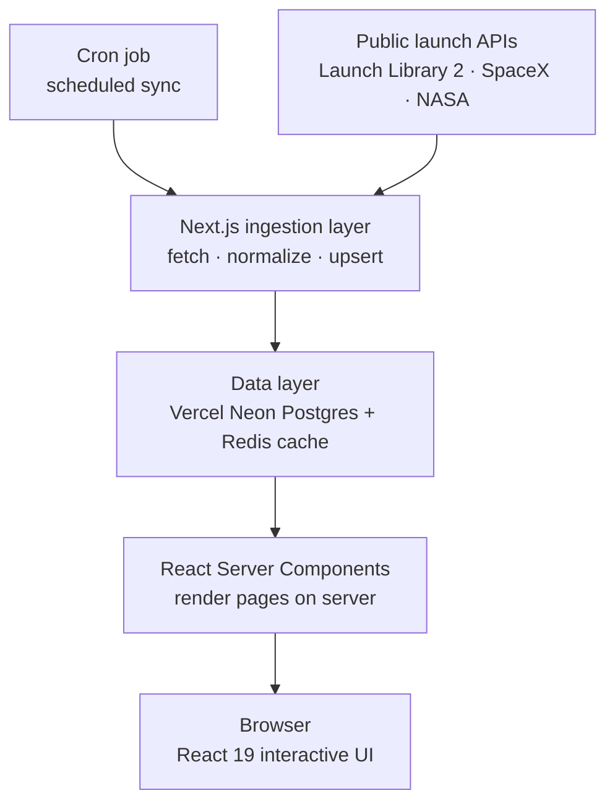

# SPACE WATCH — Architecture

A web app for browsing historical launch data from NASA, SpaceX, and other
providers, and tracking upcoming launches on a live schedule. Built on Next.js
with a futuristic, neon-blue "mission control" UI.

---

## 1. Overview

Space Watch has two core jobs:

1. **Browse history** — searchable, filterable archive of past launches with
   per-launch detail (rocket, mission, agency, outcome, media).
2. **Track the future** — an upcoming-launch schedule with countdowns and
   go/no-go status.

The defining architectural constraint is that the upstream data sources are
**rate-limited** and, in SpaceX's case, **no longer maintained**. Space Watch
therefore does not call those APIs on the request path. Instead, a scheduled job
ingests, normalizes, and stores launch data in its own database; every page
reads from that database. This keeps the UI fast, resilient to upstream
outages, and well within free-tier API limits.

---

## 2. Tech stack

| Layer | Choice | Notes |
|---|---|---|
| Framework | **Next.js 16** (App Router) | Latest stable line (16.2.x). Turbopack is the default bundler; request APIs are async; Cache Components available. |
| UI runtime | **React 19** | React Server Components by default, client components only where interactive. |
| Language | **TypeScript** | End to end, including the normalizer and DB layer. |
| Styling | **Tailwind CSS** | Neon-blue accent defined once via CSS variables / theme tokens. |
| Database | **Vercel Neon** (serverless Postgres) | System of record for normalized launches. Provisioned from the Vercel dashboard; scales to zero, so it suits a cron-driven, read-heavy workload. |
| ORM | **Drizzle** | Typed schema + migrations. |
| Cache | **Upstash Redis** | Hot reads (next launch, dashboard stats), short TTL. |
| Scheduling | **Vercel Cron** | Triggers ingestion on a fixed cadence. |
| Hosting | **Vercel** | Native Next.js deployment target. |
| Auth (optional) | **Auth.js** | Powers a per-user launch watchlist if desired. |

**Runtime requirement:** Node.js 20+ (required by Next.js 16). Scaffold with:

```bash
npx create-next-app@latest space-watch --typescript --tailwind --eslint --app --src-dir --import-alias "@/*"
```

---

## 3. Data sources

| Source | Role | Status |
|---|---|---|
| **Launch Library 2** (`ll.thespacedevs.com`) | **Primary.** Upcoming + historical launches across all providers, including SpaceX and NASA, in one schema. | Active. Free tier is heavily rate-limited (~15 req/hour anonymous), which drives the ingest-and-store design. |
| **SpaceX API v4** (`api.spacexdata.com/v4`) | Supplementary enrichment for SpaceX-specific detail (cores, booster reuse, landings). | **Fully offline**, not just read-only: every endpoint currently returns a Cloudflare 525 (origin unreachable), and LL2's cross-reference field (`r_spacex_api_id`) has been observed null on every launch checked, including ones confirmed to exist in the SpaceX API's own docs. The enrichment pass is built and correct, but enriches nothing today — see progress-tracker.md. |
| **NASA Image and Video Library** (`images-api.nasa.gov`) | Imagery enrichment: searches by mission name, best-effort. | Active, unauthenticated (no key). Note: this is a different host from the key-gated `api.nasa.gov` (APOD, Mars Photos, ...) this row originally referred to — none of those tie to a specific launch. Coverage is real but narrow: only NASA-affiliated missions return hits (routine commercial launches legitimately return zero), and match precision is rough (top hit by relevance, not guaranteed to be a liftoff photo). See progress-tracker.md. |

### Decision: Launch Library 2 is the single source of truth

**Context.** The community SpaceX API was archived by its maintainer in June 2026
and is now read-only; the maintainers recommend that consumers migrate to Launch
Library 2. LL2 already aggregates SpaceX and NASA launch data and stays current.

**Decision.** Space Watch treats **LL2 as the sole source of truth** for both the
upcoming schedule and the historical archive. The archived SpaceX API is used
only as a best-effort enrichment pass for older SpaceX records where LL2 lacks a
field (cores, booster reuse, landing outcomes). NASA's API is used for imagery
only. Neither is on the critical path.

**Consequences.**

- `lib/providers/ll2.ts` is the only client whose failure blocks an ingestion run.
  `spacex.ts` and `nasa.ts` fail soft: log, skip, keep the LL2 record.
- Every launch row carries a `source` field, so a future provider swap is a
  normalizer change, not a schema change.
- Request an **LL2 API key** (free). Anonymous access is capped near 15 req/hour,
  which is workable for cron but leaves no headroom for backfill; a key raises the
  ceiling substantially.
- Ingestion is split by cadence: a **schedule sync** designed to run every
  ~15 minutes over the upcoming window, and a **historical backfill** run
  daily, paginated and resumable so a rate-limit stall can pick back up
  where it stopped. In practice, both currently run daily — **Vercel's
  Hobby plan caps all cron jobs at once per day**, and a `*/15 * * * *`
  schedule fails deployment outright on that plan. The ~15-minute cadence
  needs a Pro (or higher) plan to actually run as designed.
- If the archived SpaceX endpoints go dark, the app degrades to LL2-only
  detail and keeps working — no migration required. This is no longer
  hypothetical: as of this writing the endpoints are unreachable and the
  correlation field is unpopulated, so the enrichment pass currently
  enriches zero launches by design, not by bug.

---

## 4. Data flow



1. **Cron triggers ingestion.** Vercel Cron calls `/api/cron/sync` on a fixed
   cadence — designed for ~15 min over the upcoming window, daily for
   historical backfill, though both run daily in practice on a Hobby plan
   (see §3's consequences).
2. **Fetch + normalize.** The route pulls from LL2 (and optionally SpaceX/NASA),
   then maps each provider's payload into one unified launch model.
3. **Upsert.** Normalized records are written to Postgres; derived hot values
   (next launch, dashboard stats) are written to Redis with a short TTL.
4. **Render.** Server Components read from Postgres/Redis and render pages on the
   server.
5. **Hydrate.** The browser hydrates only the interactive islands (countdown,
   search, filters).

No user request ever reaches an upstream API.

---

## 5. Rendering strategy

There is no marketing landing page — `/` redirects straight to `/dashboard`,
which is the app's entry point.

| Surface | Rendering | Why |
| --- | --- | --- |
| Dashboard (next launch + stats) | RSC + Redis (short TTL) | Needs freshness for countdown/status, but values are precomputed by cron. |
| Schedule (upcoming) | RSC, revalidated | Changes on the ingestion cadence, not per request. |
| Launches (historical browse) | RSC + cached, ISR-style revalidation | Large, slow-changing dataset. |
| Launch detail `/launches/[id]` | RSC + long cache | Effectively immutable once a launch is past. |
| Search / filter | Client component → `/api/launches` | Interactive querying against your own DB. |

**Server-first.** Pages are React Server Components by default and read directly
from the database — most pages ship zero page-level client JavaScript. Client
components are deliberately small and scoped:

- `CountdownTimer` — ticking T-minus display on the dashboard and detail pages.
- Search + filter controls on the historical browse page.
- Any watchlist toggle (if auth is enabled).

Caching uses Next.js 16's `revalidate` / Cache Components for rendered pages,
backed by Redis for the few values that must be fresh on every load.

---

## 6. Unified launch model

All providers are normalized into one shape so the UI never branches on source.

```ts
// lib/normalize.ts
export interface Launch {
  id: string;                 // stable internal id (slug of provider + ext id)
  source: "ll2" | "spacex" | "nasa";
  name: string;               // e.g. "Falcon 9 Block 5 | Starlink Group 12-7"
  provider: string;           // every stakeholder joined, operator first —
                              // "SpaceX", or "SpaceX · NASA · JAXA · Roscosmos"
                              // for a Crew mission. `agencyId` (not shown
                              // here) stays operator-only; see §3 and the
                              // `launch_agencies` join table.
  rocket: string;             // "Falcon 9", "SLS Block 1", ...
  net: string | null;         // ISO "no earlier than" datetime
  windowStart: string | null;
  windowEnd: string | null;
  status: "go" | "tbd" | "success" | "failure" | "hold" | "in_flight";
  padName: string | null;
  padLocation: string | null; // "Cape Canaveral, FL"
  imageUrl: string | null;
  webcastUrl: string | null;
  missionDescription: string | null;
  updatedAt: string;          // last ingestion timestamp
}
```

A Drizzle table mirrors this, with indexes on `net` (schedule ordering),
`provider`, and `status`. The normalizer is the only place provider-specific
field mapping lives; everything downstream consumes `Launch`.

---

## 7. Project structure

```
space-watch/
├─ app/
│  ├─ page.tsx                    # redirects to /dashboard (no marketing landing page)
│  ├─ dashboard/page.tsx          # overview + next-launch hero (RSC)
│  ├─ launches/
│  │  ├─ page.tsx                 # historical browse + filters
│  │  └─ [id]/page.tsx            # launch detail
│  ├─ schedule/page.tsx           # upcoming launches
│  ├─ agencies/[slug]/page.tsx
│  └─ api/
│     ├─ cron/sync/route.ts       # cron-triggered ingestion
│     └─ launches/route.ts        # client filtering / search JSON
├─ lib/
│  ├─ providers/                  # ll2.ts, spacex.ts, nasa.ts clients
│  ├─ normalize.ts                # unify provider shapes → Launch
│  ├─ db/                         # drizzle schema + queries
│  └─ cache.ts                    # redis helpers
├─ components/                    # CountdownTimer (client), cards, status pills
├─ drizzle/                       # migrations
└─ vercel.json                    # cron schedule config
```

---

## 8. Deployment

Everything targets Vercel:

- App and route handlers deploy as standard Next.js.
- `vercel.json` registers the cron schedule that hits `/api/cron/sync`. The route
  is protected by a shared secret so only Vercel Cron can invoke it.
- **Vercel Neon** is provisioned from the Vercel dashboard (Storage → Neon), which
  injects `DATABASE_URL` into the project automatically. Use the **pooled**
  connection string for serverless runtimes and the direct string for Drizzle
  migrations.
- Redis (Upstash) connects via environment variables.

```
# .env  (DATABASE_URL vars are injected by Vercel Neon)
DATABASE_URL=...           # pooled — used by the app at runtime
DATABASE_URL_UNPOOLED=...  # direct — used by Drizzle migrations
REDIS_URL=...
LL2_API_KEY=...            # raises LL2 rate limits — see §3
NASA_API_KEY=...           # imagery only
CRON_SECRET=...            # guards /api/cron/sync
```

---

## 9. Design language

- **Theme:** dark "mission control" — deep navy surfaces (`#0a0e1a` base),
  hairline borders, monospace for telemetry/countdowns.
- **Accent:** neon blue (`#3b9eff`) reserved for live and active states (next
  launch, T-minus, "GO" indicators) so it reads as a signal, not decoration.
- **Status colors:** green = go, amber = TBD, defined as semantic tokens.
- **Tokens:** the accent and surface colors are CSS variables, so the entire neon
  treatment is themable from one place.

---

## 10. Portfolio talking points

This project demonstrates, in one app:

- React Server Components and a server-first rendering model on the latest
  Next.js.
- A real-world integration constraint (rate limits + a deprecated upstream)
  solved with **scheduled ingestion into an owned datastore**, rather than
  naïve per-request fetching.
- A normalization layer that unifies multiple third-party schemas.
- A layered caching strategy (Postgres + Redis + Next.js revalidation).
- A considered, distinctive visual design with a coherent token system.
